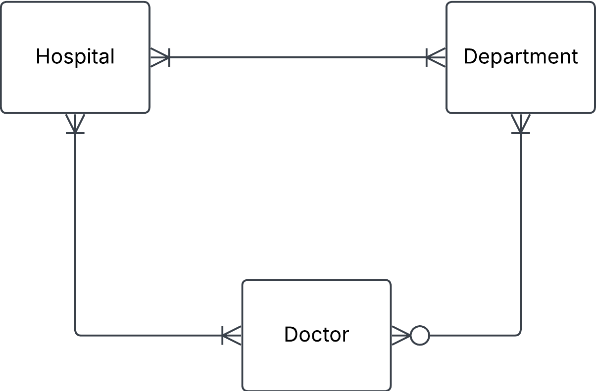
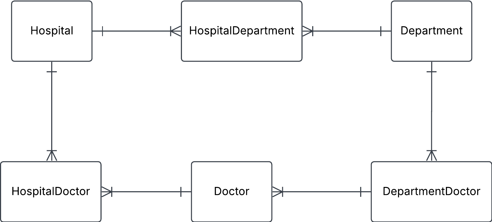

# Exercise 0

## 1. Hospital task 

You have this json data, convert it into three tables: Hospital, Department and Doctor. Fill these tables with data. Do this manually and not programmatically.

'''
{
  "hospital": "Sjukhusstock",
  "address": "Drottninggatan 3, Stockholm",
  "departments": [
    {
      "name": "Kardiologi",
      "doctors": [
        { "id": 1, "name": "Dr. Abra Abrahamson" },
        { "id": 2, "name": "Dr. Erika Eriksson" }
      ]
    },
    {
      "name": "Neurologi",
      "doctors": [{ "id": 3, "name": "Dr. Sven Svensson" }]
    }
  ]
} '''

### Solution

- identify entities 
- identify relatives and cardinales
- create conceptional ERD
- create tables 

**Initial naive conseptual ERD**

**Initial tabels**

Hospital 

| hospital_id | name         | address           |
| ----------- | ------------ | ----------------- |
| 1           | Sjukhusstock | Drottningsgatan 3 |

Department

| department_id | name       |
| ------------- | ---------- |
| 1             | Kardiologi |
| 2             | Neurologi  |

Doctor 

| doctor_id | name                |
| --------- | ------------------- |
| 1         | Dr. Abra Abrahmassn |
| 2         | Dr. Erika Eriksson  |
| 3         | Dr. Sven Svensson   |

Refind with brige tables to reflect many-to-many ralationships

HospitalDepartment

| hospital_department_id | hospital_id | department_id |
| ---------------------- | ----------- | ------------- |
| 1                      | 1           | 1             |
| 2                      | 1           | 2             |

HospitalDoctor

TODO: left to the reader

DepartmentDoctor

TODO: left to the reader

Test a join 

Want information on Sjukhusstock and its departments
- hospital_department ccan join with department_id on department table and hospital_id on hospital_table
- query name from hospital table and name from department table

TODO: left for reader: create this SQL query 